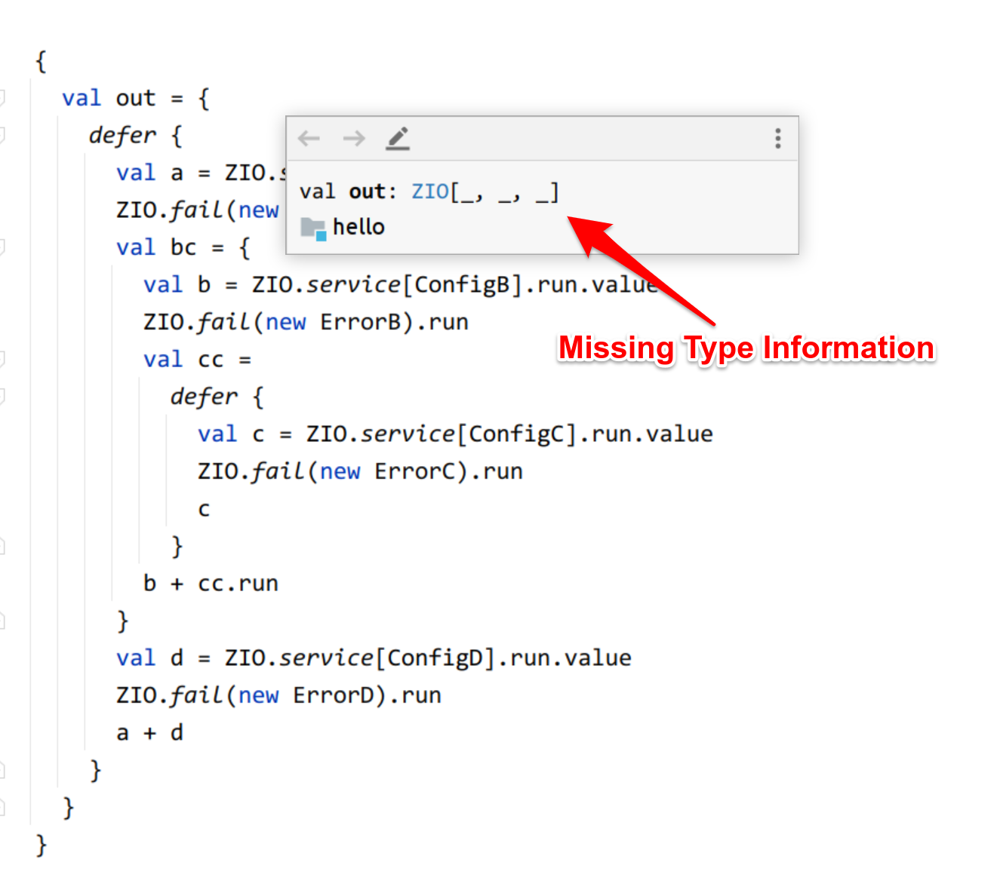
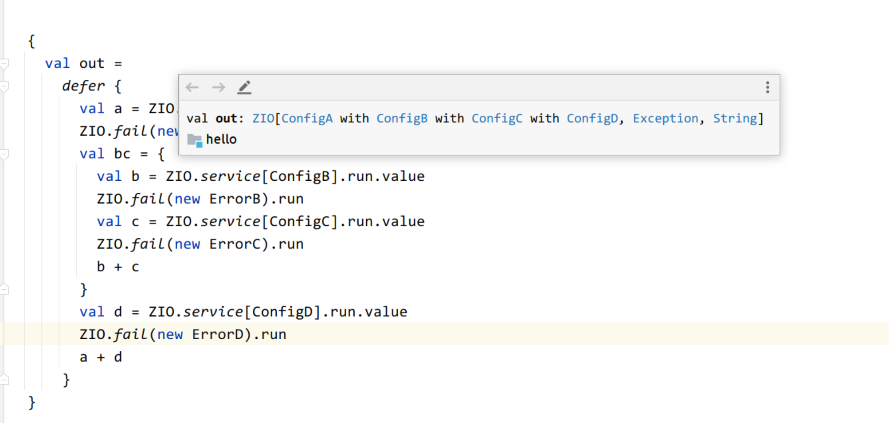
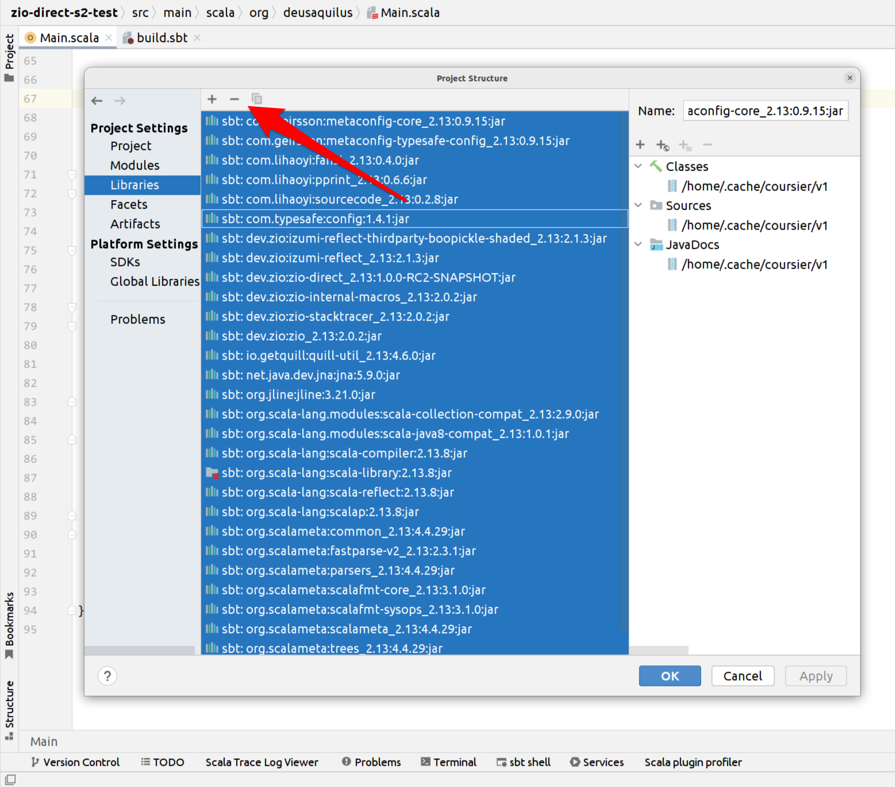
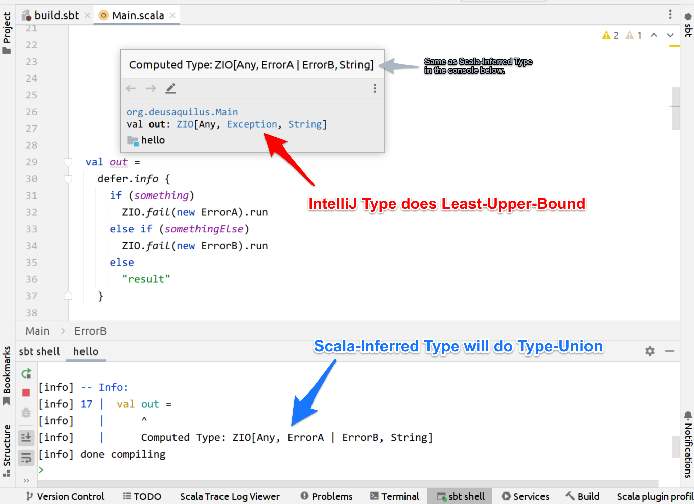

# IntelliJ Support

> It is highly recommended that you use Metals instead of IntelliJ for ZIO-Direct development since Metals correctly infers types for `defer` blocks (and other whitebox macros). This is especially true in Scala 3 where IntelliJ does not properly support union-types upon which the `defer` mechanism relies for ZIO error type composition.

It is well known that IntelliJ does not support type inference with whitebox macros because it does not read types from the Scala compiler.
Since `defer` is a whitebox macro, IntelliJ will not be able to infer the type of the `defer` block.




To circumvent this limitation, IntelliJ provides a mechanism to load custom library-specific
plugins called Library-Extensions that can provide type information to the IDE (info [here](https://github.com/JetBrains/intellij-scala/wiki/Library-Extensions)).
Library-Extension plugins are automatically loaded by IntelliJ when a library like zio-direct "asks" for one
by providing a configuration file in the library's jar.

ZIO-Direct provides a Library-Extension plugin that is loaded by IntelliJ to provide type information.

## Installation

1. When adding a library dependency on zio-direct in the build.sbt file:
    ```scala
    // Build.sbt
    libraryDependencies += "dev.zio" %% "zio-direct" % "..."
    ```
2. Click the `reload` button in the SBT panel of the IntelliJ project.

    

3. Once the SBT configuration is reloaded, the following message will appear in the bottom right corner of the IntelliJ project window. Click "Yes".

    

4. IntelliJ will automatically download the zio-direct library and the Library-Extension plugin. The typing of `defer` blocks should then work as expected.

    

## Troubleshooting

If the "Extensions Available" dialog does not appear or a manual reload of the zio-direct-intellij plugin is required. This typically involves manually clearing the imported libraries and then forcing a re-import from SBT. This is necessary so that IntelliJ runs the correct triggers to load the zio-direct-intellij plugin.

1. Go to the `Project Structure` -> `Libraries` dialog. Select all the libraries (Cmd+A) and click the `-` button.

    

2. Once this is complete and all the libraries are removed. Go back to the SBT panel and click the `reload` button.

    

3. Once the SBT project structure is reloaded, the "Extensions Available" dialog should appear.

    

## Caveats

#### Type Incongruence
Since the zio-direct-intellij plugin is still experimental, the types that it infers may be incorrect. Use the `defer.info` function to check the Scala-compiler inferred type of the `defer` block.


#### Scala 3 Union-Type Limitations

Additionally, since IntelliJ does not properly support union-types, it is impossible to correctly infer the error type of a `defer` that composes multiple ZIO effects with errors in Scala 3. Instead, the zio-direct-intellij plugin will use a least-upper bound instead of a union-type.



While in practice, this is not a problem since the least-upper bound is always a supertype of the union-type, it is still a limitation of the zio-direct-intellij plugin. If any unexpected issues occur, you can force zio-direct to infer least-upper-bound types by using `defer(Use.withAbstractError) { ... }` however as this setting is not fully supported (e.g. it does not correctly infer error-types that contain type-parameters) it must be used with caution.
